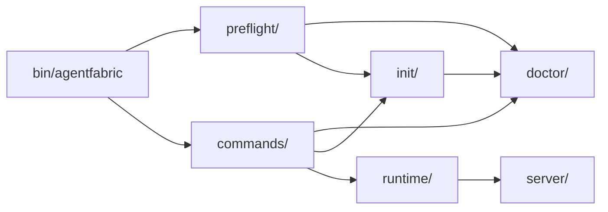
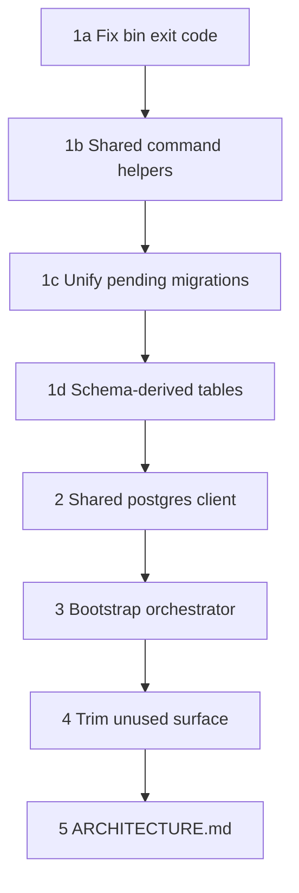

# CLI Package — Incremental Organization Plan

## Current State (Summary)

The CLI is ~78 files across five concerns that already have reasonable top-level boundaries:



**What works well (keep as-is):**
- Command framework (`command-*.ts` + `commands/`) is consistent and easy to extend
- `doctor/checks/` split by concern is clear
- `runtime/` → `server/` separation is sound
- `process/` is self-contained

**Main sustainability risks (fix incrementally):**
1. Migration/DB probe logic lives under `doctor/` but is owned by `init/` and `preflight/` too
2. Three overlapping bootstrap paths (`init`, `start` preflight in bin, `doctor`) with duplicated strings and exit-code handling
3. Postgres client config duplicated in [`doctor/db-probe.ts`](packages/cli/src/doctor/db-probe.ts) and [`db/index.ts`](packages/cli/src/db/index.ts)
4. [`bin/agentfabric`](packages/cli/bin/agentfabric) ignores `CommandDiscovery.discover()` exit code (line 272)
5. `EXPECTED_TABLES` in `db-probe.ts` must be manually synced with [`schema.ts`](packages/cli/src/schema.ts)
6. Unused abstractions (`CommandLifecycle` hooks, `getCommandMetadata`) add noise

---

## Phase 1 — Correctness & Shared Utilities (low risk)

### 1a. Fix exit-code propagation in bin

[`bin/agentfabric`](packages/cli/bin/agentfabric) calls `discover()` but discards its return value. Unknown commands and flag errors can exit 0.

```ts
// bin/agentfabric (line ~272)
const exitCode = await Container.resolve(CommandDiscovery).discover();
process.exit(exitCode);
```

Align with how bootstrap preflight already calls `process.exit(preflightExitCode)`.

### 1b. Extract shared command helpers (no folder moves)

Create small shared modules at existing locations:

| New file | Extracts from | Purpose |
|----------|---------------|---------|
| [`src/commands/_shared/load-dotenv-if-allowed.ts`](packages/cli/src/commands/_shared/load-dotenv-if-allowed.ts) | Identical blocks in [`init.ts`](packages/cli/src/commands/init.ts) and [`doctor.ts`](packages/cli/src/commands/doctor.ts) | Single `--dotenv` guard |
| [`src/doctor/format-migration-count.ts`](packages/cli/src/doctor/format-migration-count.ts) | [`init.ts`](packages/cli/src/commands/init.ts) + [`run-bootstrap-preflight.ts`](packages/cli/src/preflight/run-bootstrap-preflight.ts) | `"1 migration"` / `"N migrations"` labels |
| [`src/doctor/exit-with-report.ts`](packages/cli/src/doctor/exit-with-report.ts) | Scattered `process.exitCode = 1` + report rendering in doctor/init/bootstrap | Unified exit policy using existing `shouldExitWithError()` |

### 1c. Unify migration pending detection

Today two paths derive pending state differently:
- [`doctor/checks/database.ts`](packages/cli/src/doctor/checks/database.ts) — uses `compareMigrations()` directly
- [`init/apply-migrations.ts`](packages/cli/src/init/apply-migrations.ts) — uses `getPendingMigrationTags()` with extra `!tableExists` branch

**Change:** Make `getPendingMigrations()` in [`apply-migrations.ts`](packages/cli/src/init/apply-migrations.ts) the single source of truth. Have `runDatabaseChecks()` call it and map the result to pass/fail check items (no behavior change for users).

### 1d. Derive `EXPECTED_TABLES` from schema

Replace the hardcoded array in [`doctor/db-probe.ts`](packages/cli/src/doctor/db-probe.ts) with a derived list from Drizzle table exports in [`schema.ts`](packages/cli/src/schema.ts) (e.g. `Object.keys(schema)` or an explicit `EXPECTED_TABLES` constant co-located with schema). Eliminates drift when tables are added.

---

## Phase 2 — Shared DB Client Config (medium risk, no moves)

Extract duplicated Postgres wiring from [`db-probe.ts`](packages/cli/src/doctor/db-probe.ts) and [`db/index.ts`](packages/cli/src/db/index.ts) into a shared builder:

**New file:** [`src/db/create-postgres-client.ts`](packages/cli/src/db/create-postgres-client.ts)

```ts
// Conceptual API
createPostgresClient({
  connectionString: string | undefined,
  poolSize: number,
  onInvalidEnv: "throw" | "silent",  // probe vs production
})
```

Both `db-probe.ts` and `db/index.ts` become thin wrappers with their respective defaults (pool=1 silent vs pool=15 throw). SSL, timeout, and `parsePositiveIntegerEnv` logic lives in one place.

---

## Phase 3 — Bootstrap Flow Clarity (no folder moves)

### 3a. Shared orchestrator for init + start preflight

The overlap between [`init/run-init.ts`](packages/cli/src/init/run-init.ts) and [`preflight/run-bootstrap-preflight.ts`](packages/cli/src/preflight/run-bootstrap-preflight.ts) is intentional (auto-apply vs interactive confirm), but the orchestration is duplicated.

**New file:** [`src/init/run-setup.ts`](packages/cli/src/init/run-setup.ts) (or rename `run-init.ts`)

```ts
type SetupMode = "auto" | "confirm";

runSetup({ mode: "auto" })      // used by init command
runSetup({ mode: "confirm" })   // used by bootstrap preflight
```

Shared steps: `runDoctorPreflight()` → `getPendingMigrations()` → apply (with or without `confirmMigrationApply()`). Each caller keeps its own report title and exit-code surface.

### 3b. Document the three paths

Add a short module-level comment block (or a section in [`packages/cli/README.md`](packages/cli/README.md)) explaining:

| Entry | Checks | Migrations |
|-------|--------|------------|
| `agentfabric doctor` | Full (env, DB, schema, artifacts) | Report only, never apply |
| `agentfabric init` | Preflight subset | Auto-apply |
| `agentfabric start` | Preflight subset (in bin, before dispatch) | Interactive confirm, then apply |

This prevents future contributors from "fixing" one path and breaking another.

### 3c. Keep bootstrap preflight in bin (incremental scope)

Moving preflight into `Start.onBeforeExecute()` would be cleaner architecturally but is a **moderate** change (timing, TTY context, test surface). Defer to a later phase; document the current split instead.

---

## Phase 4 — Trim Unused Surface Area

Remove or mark deprecated without deleting the pattern:

- **`CommandLifecycle` hooks** — Add a one-line JSDoc on the base class: "Hooks reserved for future use; no command implements them yet." Do not wire hooks until a real use case appears.
- **`getCommandMetadata()`** — If truly unused, remove export; catalog already uses explicit `*CommandMetadata` constants (intentional duplication for `satisfies` typing).
- **`doctor/checks/runtime.ts`** — Rename to `cli-runtime.ts` or `node-version.ts` to avoid confusion with `runtime/agentfabric-runtime.ts`. Update imports only; no logic change.

---

## Phase 5 — Lightweight Architecture Doc

Add [`packages/cli/ARCHITECTURE.md`](packages/cli/ARCHITECTURE.md) (~60 lines) covering:

- Entry flow (`bin` → preflight gate → command dispatch)
- Module ownership table (who owns migrations, who owns diagnostics)
- How to add a new command (catalog + `commands/` file + optional domain module)
- Dev vs prod entry paths (`pnpm dev` bypasses CLI; `agentfabric start` does not)

Update [`AGENTS.md`](AGENTS.md) with a one-line pointer to this doc.

---

## Dependency Rules (enforce going forward)

Document these conventions in `ARCHITECTURE.md — no new tooling required:

```
commands/     → may import doctor/, init/, preflight/, runtime/, process/
preflight/    → may import doctor/, init/ (apply-migrations only)
init/         → may import doctor/ (preflight checks only)
doctor/       → must NOT import init/ or preflight/
runtime/      → may import server/, db/, lib/
server/       → may import db/, lib/, schema
```

The main fix: **`doctor/checks/database.ts` should call `getPendingMigrations()` from `init/apply-migrations.ts`** (or a future `migrations/status.ts` extracted from it) rather than re-deriving state. This is the highest-value ownership clarification without moving files.

---

## What We Are NOT Doing (incremental scope)

- Moving `doctor/db-probe.ts` → `db/probe.ts` (defer)
- Moving `schema.ts` → `db/schema.ts` (defer)
- Grouping `command-*.ts` into `cli/` subfolder (defer)
- Moving bootstrap preflight into `start` command (defer)
- Adding a test suite (valuable but separate effort; note as follow-up)
- Splitting [`global.config.ts`](packages/cli/src/global.config.ts) (small file, low pain)

---

## Suggested Implementation Order



Each step is independently committable. Phases 1–3 deliver the most maintainability gain; phases 4–5 are polish.

## Risk Notes

- **Phase 2** (shared postgres client): Test doctor, init, and server startup after merge — pool size and error-handling semantics must remain distinct.
- **Phase 1c** (unified pending detection): Verify `!tableExists` edge case still reports correctly in doctor (currently a fail check; apply-migrations treats all journal entries as pending).
- **Build sync**: [`sync-migration-journal`](packages/cli/package.json) copies journal to `dist/doctor/` — no change needed for incremental plan, but note in ARCHITECTURE.md.
