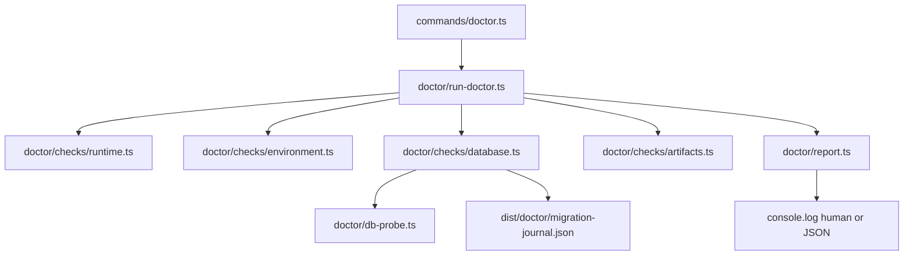

# Doctor Command Plan

## Goal

Add `agentfabric doctor` — a preflight diagnostic command that validates initial setup before `agentfabric start`, prints a structured report, and sets `process.exitCode = 1` when checks fail (or when warnings exist and `--strict` is passed).

## Architecture



**Critical constraint:** Do **not** import [`packages/cli/src/db/index.ts`](packages/cli/src/db/index.ts) or [`packages/cli/src/lib/auth.ts`](packages/cli/src/lib/auth.ts) in doctor code — both throw at module load when env vars are missing. All DB probing uses a lazy, isolated `postgres` client in a new `doctor/db-probe.ts`.

## Check categories

### 1. Runtime (`doctor/checks/runtime.ts`)

| Check | Status | Notes |
|-------|--------|-------|
| Node.js version | fail | Reuse `semver` + `engines.node` from [`package.json`](packages/cli/package.json) (same logic as [`bin/agentfabric`](packages/cli/bin/agentfabric)) |
| CLI version | pass | Read from `package.json` |

### 2. Environment (`doctor/checks/environment.ts`)

Pure validators (no side effects) mirroring existing parsers in [`db/index.ts`](packages/cli/src/db/index.ts), [`auth-session-policy.ts`](packages/cli/src/lib/auth-session-policy.ts), and [`api-server.ts`](packages/cli/src/server/api-server.ts).

**Required (fail if missing/invalid):**
- `DATABASE_URL`
- `BETTER_AUTH_SECRET` — warn if length &lt; 32 chars
- `BETTER_AUTH_BASE_URL` — warn if not a valid URL

**Optional (warn on invalid, pass/info when unset):**
- `PORT`, `DB_SSL`, `DB_IDLE_TIMEOUT`, `DB_CONNECT_TIMEOUT`, `DB_POOL_SIZE`
- `AGENTFABRIC_AUTH_SESSION_POLICY_MODE`, `AGENTFABRIC_AUTH_MAX_SESSIONS*`
- `RATE_LIMIT_MAX`, `RATE_LIMIT_WINDOW`, `AGENTFABRIC_LOG_LEVEL`
- `AGENTFABRIC_FRONTEND_ENABLED`

**Informational (pass/info only):**
- `.env` file presence in cwd (not required; note that production expects OS env)

### 3. Database (`doctor/checks/database.ts`)

Skipped as a group when `DATABASE_URL` is missing. Otherwise:

| Check | Status | Implementation |
|-------|--------|----------------|
| PostgreSQL connectivity | fail | `SELECT 1` via isolated `postgres` client with same SSL/timeout options as [`db/index.ts`](packages/cli/src/db/index.ts) |
| Migration journal table | fail/warn | Query `drizzle.__drizzle_migrations`; fail if table missing |
| Pending migrations | fail | Compare applied `hash` count/tags against bundled journal (see build step below) |
| Core tables exist | fail | Verify tables from [`schema.ts`](packages/cli/src/schema.ts): `user`, `session`, `account`, `verification`, `workspace`, `workspace_member`, `invitation`, `apikey` via `information_schema.tables` |

On migration mismatch, remediation hint: `pnpm --filter agentfabric db:migrate`

### 4. Artifacts & runtime state (`doctor/checks/artifacts.ts`)

| Check | Status | Notes |
|-------|--------|-------|
| Built UI (`dist/ui/index.html`) | warn in production when frontend enabled; info in dev | Matches [`api-server.ts`](packages/cli/src/server/api-server.ts) frontend logic |
| Vite dev server (`localhost:5173`) | warn in dev only | TCP connect probe; dev UI proxy depends on it |
| Running processes | info | Reuse [`ProcessManager`](packages/cli/src/process/process-manager.ts) — informational, not pass/fail |

## Command interface

New file: [`packages/cli/src/commands/doctor.ts`](packages/cli/src/commands/doctor.ts)

```typescript
// Flags (arktype, same pattern as status.ts)
{
  "json?": "boolean",
  "strict?": "boolean",   // treat warnings as failures
  "dotenv?": "boolean",   // dev-only: load .env from cwd
  "help?": "boolean",
}
```

**`--dotenv` behavior (per your preference):**
- Allowed only when `NODE_ENV !== "production"`
- If used in production → **fail** immediately with a clear message
- Uses `dotenv` (move from devDependency to dependency, or dynamic import with graceful error if unavailable in prod — prefer adding `dotenv` as a runtime dependency since doctor needs it in dev)

Register in [`packages/cli/src/command-catalog.ts`](packages/cli/src/command-catalog.ts).

## Report format

Shared types in `doctor/types.ts`:

```typescript
type CheckStatus = "pass" | "warn" | "fail" | "skip" | "info";
interface DoctorCheck { id: string; label: string; status: CheckStatus; message: string; hint?: string; }
interface DoctorReport { summary: { pass: number; warn: number; fail: number; skip: number }; groups: DoctorGroup[]; }
```

**Human output** (default) — grouped sections with symbols (`✓` / `⚠` / `✗` / `○`), summary line, and remediation hints for failures.

**JSON output** (`--json`) — full `DoctorReport` object.

**Exit codes:**
- `0` — no failures (warnings OK unless `--strict`)
- `1` — any `fail`, or any `warn` when `--strict`

Set `process.exitCode` in the command's `run()` (same pattern as [`stop.ts`](packages/cli/src/commands/stop.ts)).

## Build: bundle migration journal

Migrations are excluded from the compiled CLI ([`tsconfig.build.json`](packages/cli/tsconfig.build.json)) and not in npm `files`. To compare migration state in published installs:

1. Add build script `sync-migration-journal` in [`package.json`](packages/cli/package.json):
   `shx mkdir -p dist/doctor && shx cp migrations/meta/_journal.json dist/doctor/migration-journal.json`
2. Chain into existing `build` script after `compile-cli`
3. Doctor resolves journal from `join(__dirname, "migration-journal.json")` relative to compiled `dist/doctor/` module

Fallback for monorepo dev: also try `packages/cli/migrations/meta/_journal.json` relative to package root. If journal unavailable → `warn` (cannot verify pending migrations) but still run DB connectivity + table checks.

## File layout (new)

```
packages/cli/src/
  commands/doctor.ts
  doctor/
    types.ts
    run-doctor.ts          # orchestrates checks, builds DoctorReport
    report.ts              # renderHumanReport / renderJsonReport
    db-probe.ts            # lazy postgres client + query helpers
    migration-journal.ts   # load + parse journal, compare applied hashes
    checks/
      runtime.ts
      environment.ts
      database.ts
      artifacts.ts
```

## Docs updates

- [`packages/cli/README.md`](packages/cli/README.md) — add `doctor` command section with examples:
  - `agentfabric doctor`
  - `agentfabric doctor --json`
  - `NODE_ENV=development agentfabric doctor --dotenv`
- [`AGENTS.md`](AGENTS.md) — add `doctor` to CLI commands list

## Example output

```
AgentFabric Doctor

Runtime
  ✓ Node.js v24.2.0 (requires >=24)
  ✓ agentfabric 0.0.2

Environment
  ✓ DATABASE_URL — set
  ✓ BETTER_AUTH_SECRET — set
  ⚠ BETTER_AUTH_SECRET — only 16 characters (recommend >= 32)
  ✓ BETTER_AUTH_BASE_URL — https://localhost:5678

Database
  ✓ PostgreSQL connection
  ✗ Migrations — 4/6 applied (pending: 0004_workspace_organization, 0005_melodic_umar)
    → Run: pnpm --filter agentfabric db:migrate
  ✓ Schema tables — 8/8 present

Artifacts
  ✓ Built UI — dist/ui/index.html found
  ○ Running processes — none

Summary: 7 passed, 1 warning, 1 failed
```

## Testing approach

Manual verification (no test harness exists today):

```bash
# Missing env vars
agentfabric doctor

# Dev with .env
NODE_ENV=development agentfabric doctor --dotenv

# JSON + strict
agentfabric doctor --json --strict

# After db:migrate with full env
agentfabric doctor   # expect exit 0
```
