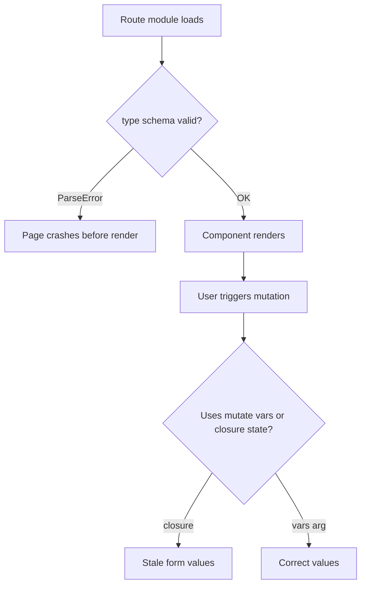

# Fix Dev Route Pages

## Problem summary

The dev pages under [`web/src/routes/dev/`](web/src/routes/dev/) were refactored to TanStack Query + arktype. That refactor introduced **runtime crashes** TypeScript cannot catch, plus a few remaining React patterns that can cause stale state or lint noise.



## Root causes found

### 1. Arktype schema crash (critical — `table-apikey-integration`)

In arktype 2.2, optional keys **cannot** have inline defaults:

```ts
// CRASHES at module load (ParseError)
"limit?": "number.integer >= 1 <= 100 = 25"

// OK — defaults handled at call site
"limit?": "number.integer >= 1 <= 100"
```

This throws before React renders anything. Already fixed in the working tree; verify no other dev schemas use `?` + `=` together.

### 2. Wrong table API URL (committed version)

[`web/src/routes/dev/table-apikey-integration.tsx`](web/src/routes/dev/table-apikey-integration.tsx) previously built:

- **Wrong:** `/api/v1/table/table`
- **Correct:** `/api/v1/table?name=session` (matches [`packages/cli/src/server/routes/v1/table/route.ts`](packages/cli/src/server/routes/v1/table/route.ts))

Working tree already uses the correct path via `apiBaseURL` from [`web/src/lib/env.ts`](web/src/lib/env.ts).

### 3. React Query / hooks issues (remaining in working tree)

| File | Issue | Fix |
|------|-------|-----|
| [`analytics.tsx`](web/src/routes/dev/analytics.tsx) | `useState` declared **after** `useMutation` hooks that call `setStatusMessage` | Move `useState("Ready")` above all mutations |
| [`alert-banner.tsx`](web/src/routes/dev/alert-banner.tsx) | Over-engineered `useMutation` + `useEffect([seedBanners.mutate])` for mount seeding | Revert to `useEffect(() => { addBanner(...) }, [addBanner])` — `addBanner` is stable via `useCallback` in the provider |
| [`api-playground.tsx`](web/src/routes/dev/api-playground.tsx) | `verifyApiKey.onSuccess` reads closure `configId` instead of mutation vars | Use `onSuccess: (_data, vars) => setStatusMessage(...vars.configId...)` |
| [`impersonate-user.tsx`](web/src/routes/dev/impersonate-user.tsx) | Duplicate `@tanstack/react-query` imports | Merge into one import line |

The stale-closure and side-effect-in-`mutationFn` fixes from the prior session (passing `mutate({ ...formValues })`, moving `setStatusMessage` to `onSuccess`) are already correct in the working tree — keep those.

### 4. Biome check failures (non-runtime)

All 5 dev files fail `pnpm run lint` due to **formatting** and **import organization** only. Run `biome check --write src/routes/dev/` after code fixes.

## Files to change

- [`web/src/routes/dev/table-apikey-integration.tsx`](web/src/routes/dev/table-apikey-integration.tsx) — confirm arktype schema + URL (likely no further edits)
- [`web/src/routes/dev/analytics.tsx`](web/src/routes/dev/analytics.tsx) — reorder hooks
- [`web/src/routes/dev/alert-banner.tsx`](web/src/routes/dev/alert-banner.tsx) — simplify mount seed effect
- [`web/src/routes/dev/api-playground.tsx`](web/src/routes/dev/api-playground.tsx) — fix `verifyApiKey` onSuccess
- [`web/src/routes/dev/impersonate-user.tsx`](web/src/routes/dev/impersonate-user.tsx) — merge imports

No changes to [`web/src/routes/dev.tsx`](web/src/routes/dev.tsx) (per your preference — no `/dev` index hub).

## Verification

1. **Runtime schema check** — node script importing arktype schemas from all three pages that define `type({...})` must not throw
2. **`pnpm --filter agentfabric-web typecheck`** — must pass
3. **`pnpm --filter agentfabric-web exec vite build`** — must pass
4. **`pnpm --filter agentfabric-web exec biome check src/routes/dev`** — must pass after `--write`
5. **Manual smoke test** (dev server on `:5173`):
   - `/dev/table-apikey-integration` — page loads (no white screen / ParseError)
   - `/dev/analytics` — buttons update status message
   - `/dev/alert-banner` — banners seed once on load
   - `/dev/api-playground` and `/dev/impersonate-user` — forms submit without stale values
