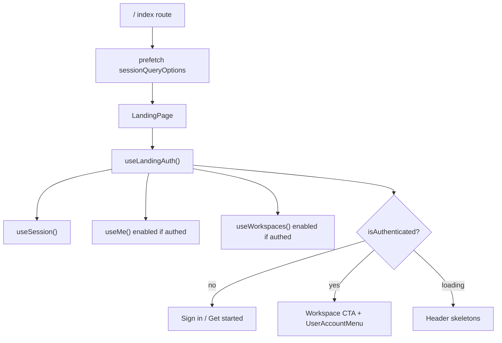

# Landing Page Logged-In UX

## Problem

[`landing-header.tsx`](web/src/features/landing/components/landing-header.tsx), [`landing-hero.tsx`](web/src/features/landing/components/landing-hero.tsx), and [`landing-cta.tsx`](web/src/features/landing/components/landing-cta.tsx) always render guest CTAs. A signed-in user still sees **Sign in** / **Get started** in the header and hero (the DOM paths you pointed at).

The workspace shell already has the right patterns in [`workspace/layouts/index.tsx`](web/src/features/workspace/layouts/index.tsx): avatar dropdown, sign out, theme toggle, and workspace list — but nothing is shared with the landing page.

## Approach

Stay on `/` when logged in (per your choice). Conditionally swap guest CTAs for profile + workspace access in three places, using the same session/me/workspaces data the app already uses elsewhere.



## Implementation

### 1. Shared auth UI (reuse, don’t duplicate)

**New:** [`web/src/features/auth/components/user-account-menu.tsx`](web/src/features/auth/components/user-account-menu.tsx)

Extract the avatar dropdown from workspace sidebar footer into a reusable component:

- Props: `user` (name/email/image), `variant: "sidebar" | "header"`, optional `onNavigate` callback (for closing mobile sheet)
- Menu contents: email label, theme toggle, sign out (reuse `useSignOut`, `useTheme`, `useNavigate`)
- Use existing shadcn `DropdownMenu` + `Avatar` (same as workspace layout)

**New:** [`web/src/lib/user-display.ts`](web/src/lib/user-display.ts)

Small helper: `getUserInitials(name?: string)` — currently duplicated inline in workspace layout.

**Refactor:** [`web/src/features/workspace/layouts/index.tsx`](web/src/features/workspace/layouts/index.tsx) — replace inline dropdown with `UserAccountMenu variant="sidebar"`.

### 2. Landing auth hook

**New:** [`web/src/features/landing/hooks/use-landing-auth.ts`](web/src/features/landing/hooks/use-landing-auth.ts)

```ts
// Conceptual return shape
{
  isAuthenticated: boolean
  isPending: boolean          // session still loading
  user: UserRecord | undefined
  workspaces: Workspace[]
  workspaceHref: string       // smart default destination
}
```

Logic:

- `useSession()` → `isAuthenticated = Boolean(data?.session)`
- `useMe()` and `useWorkspaces()` with `enabled: isAuthenticated` (same pattern as dev playground in [`api-playground.tsx`](web/src/routes/dev/api-playground.tsx))
- `workspaceHref`:
  - 1 workspace → `/workspace/$workspaceId`
  - 0 or many → `/workspace`
- Prefer `me.user` for display name; fall back to `session.user`

### 3. Landing account actions component

**New:** [`web/src/features/landing/components/landing-account-actions.tsx`](web/src/features/landing/components/landing-account-actions.tsx)

Single component consumed by header (desktop), mobile sheet, hero, and CTA. Props: `layout: "header" | "hero" | "cta" | "mobile"`.

**Guest (unchanged):** Sign in + Get started links.

**Authenticated — header (desktop):**

| Element | Behavior |
|---------|----------|
| Primary button | **Open workspace** → `workspaceHref` |
| Secondary (if 2+ workspaces) | Compact **Workspaces** dropdown listing up to 5 workspaces + “View all” |
| Avatar menu | `UserAccountMenu variant="header"` |

**Authenticated — mobile sheet:** Replace “Account” guest buttons with a user card (avatar, name, email) + workspace links + sign out.

**Authenticated — hero:** Replace auth buttons with:
- Badge: `Signed in as {firstName}`
- Primary: **Open workspace**
- Secondary: **All workspaces** (if multiple) + keep GitHub / Read docs

**Authenticated — CTA section:** Swap copy to “Welcome back, {name}” / “Pick up where you left off”, show workspace list (reuse card row styling from [`workspace/index.tsx`](web/src/routes/_auth/workspace/index.tsx)) instead of Create account / Sign in.

**Loading:** In header, render two small `Skeleton` pills while `isPending` — avoids flashing guest buttons.

### 4. Wire into existing landing components

| File | Change |
|------|--------|
| [`landing-header.tsx`](web/src/features/landing/components/landing-header.tsx) | Replace lines 39–119 guest block with `<LandingAccountActions layout="header" />`; mobile Account section uses `layout="mobile"` |
| [`landing-hero.tsx`](web/src/features/landing/components/landing-hero.tsx) | Replace hero CTA row with `<LandingAccountActions layout="hero" />` |
| [`landing-cta.tsx`](web/src/features/landing/components/landing-cta.tsx) | Replace bottom buttons with `<LandingAccountActions layout="cta" />`; adjust title/description when authed |
| [`routes/index.tsx`](web/src/routes/index.tsx) | Add `loader` to `prefetchQuery(sessionQueryOptions)` — reduces auth UI flash on first paint |

### 5. UX details

- **No redirect** from `/` when authenticated.
- **Sign out** from landing menu clears session cache and stays on `/` (guest UI returns).
- **Workspace errors** degrade gracefully: show profile menu + “Open workspace” even if workspace list fetch fails.
- **Visual consistency:** match landing header styling (rounded-2xl, `size="sm"` buttons, backdrop blur) — header variant uses `Button` + `DropdownMenu`, not sidebar primitives.
- **Accessibility:** avatar trigger gets `aria-label="Account menu"`; workspace dropdown gets `aria-label="Your workspaces"`.

## Files touched (summary)

| Action | Path |
|--------|------|
| New | `web/src/lib/user-display.ts` |
| New | `web/src/features/auth/components/user-account-menu.tsx` |
| New | `web/src/features/landing/hooks/use-landing-auth.ts` |
| New | `web/src/features/landing/components/landing-account-actions.tsx` |
| Edit | `landing-header.tsx`, `landing-hero.tsx`, `landing-cta.tsx`, `routes/index.tsx` |
| Refactor | `workspace/layouts/index.tsx` (use shared menu) |

## Manual test plan

1. **Guest:** `/` shows Sign in / Get started in header, hero, and CTA.
2. **Logged in, 0 workspaces:** header shows Open workspace → `/workspace`; profile menu works; hero/CTA personalized.
3. **Logged in, 1 workspace:** primary CTA goes directly to that workspace.
4. **Logged in, 2+ workspaces:** workspace dropdown in header; hero shows All workspaces.
5. **Sign out** from landing menu → guest UI returns without page reload issues.
6. **Mobile (< lg):** sheet shows profile + workspace links instead of auth buttons.
7. **Hard refresh on `/` while logged in:** brief skeleton, then authed UI (no guest flash).
