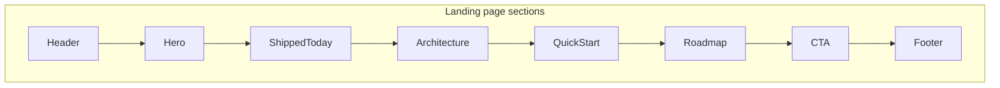

# Landing Page Redesign — Honest Foundation Positioning

## Problem with the current page

[`web/src/routes/index.tsx`](web/src/routes/index.tsx) has two main issues:

1. **Content misalignment** — Copy promises features that are not built yet (workflow orchestration, multi-step automations, "runtime modules for task execution"). Per [`AGENTS.md`](AGENTS.md), the runtime only hosts the Fastify API server; there is no workflow engine or workspace backend.
2. **Visual noise** — Four overlapping background layers, spinning decorative circle, teal/orange gradient overload, and vague stat cards ("CLI + Web", "Brand promise") that read like placeholder marketing rather than product truth.

## Design direction

Keep the **teal/cyan brand** already used in auth pages ([`auth-page-layout.tsx`](web/src/features/auth/components/auth-page-layout.tsx)) and workspace shell, but simplify:

- One subtle grid + one soft radial accent (same pattern as auth, not 4+ layers)
- Prefer **theme tokens** (`bg-background`, `text-foreground`, `border-border`, `text-muted-foreground`, `bg-primary`) over hard-coded slate/teal hex stacks
- Remove decorative animations (spinning ring, excessive blur orbs)
- Tighter typography hierarchy: one strong hero headline, short subcopy, scannable sections



## New page structure and copy

### 1. Header
- Logo + "AgentFabric" (link to `/`)
- Anchor nav: **Platform**, **Architecture**, **Quick start**, **Roadmap**
- Actions: **Sign in** (outline) + **Get started** (primary) — currently missing from header

### 2. Hero
**Headline:** *Build, deploy, and manage AI agents — starting with the platform foundation.*

**Subhead:** AgentFabric is a monorepo framework: a publishable CLI that runs a Fastify API server, PostgreSQL-backed auth, and a React control plane — one artifact in production.

**CTAs:** Sign up, GitHub repo, optional docs link (`README` on GitHub).

**Hero aside (replace stat cards):** A compact "At a glance" panel with **real** facts:
- `agentfabric start` — detached process + API on `:5678`
- Better Auth — sessions, admin roles, `pk_` / `sk_` API keys
- Single deploy — CLI serves built SPA from `dist/ui`

### 3. Platform — Available today (`#platform`)
Six feature cards grounded in implemented capabilities from [`README.md`](README.md) / [`AGENTS.md`](AGENTS.md):

| Card | Real capability |
|------|-----------------|
| CLI runtime | `start` / `status` / `stop`, detached store at `~/.agentfabric/processes.json` |
| API server | Fastify 5, autoloaded routes, rate limiting on `/api/*`, graceful shutdown |
| Auth & access | Email/password, admin plugin, Bearer API keys, session governance via `x-device-id` |
| Database | PostgreSQL + Drizzle, migrations, PgBouncer-safe pool config |
| Observability | `/health`, Prometheus `/metrics`, Fastify/Pino stdout logging |
| Web dashboard | React 19 SPA — landing, auth, workspace shell (TanStack Router/Query, shadcn/ui) |

Each card: icon, title, 1–2 sentence description, optional small "Implemented" badge — no filler taglines like "Built on modular runtime components."

### 4. Architecture (`#architecture`)
Replace the generic ASCII tree with a **clear system diagram** in a dark card:

```
Browser (React SPA)
    ↕
Fastify API (:5678) — auth, management, metrics
    ↕
PostgreSQL (Drizzle)
    ↑
CLI (`agentfabric start`) — process manager + static UI host
```

Use [`Accordion`](web/src/components/ui/accordion.tsx) or a simple 2-column layout: diagram left, bullet list of packages (`packages/cli`, `web`) right.

### 5. Quick start (`#quickstart`)
Developer-focused code block (styled `<pre>` in a Card, matching existing pattern):

```bash
pnpm install
pnpm dev                    # CLI watch + Vite dev server

# Production-style
pnpm build
agentfabric start           # API + SPA from dist/ui
```

Brief note: required env vars (`DATABASE_URL`, `BETTER_AUTH_SECRET`, `BETTER_AUTH_BASE_URL`) — one line, link to README.

### 6. Roadmap (`#roadmap`)
Honest "Coming next" section with muted cards and **Coming soon** badges:
- Agent workflow engine and scheduler
- Workspace list/detail API (replace mock `useWorkspaces`)
- OAuth providers (Google, GitHub — UI already scaffolded on auth pages)

Avoid presenting these as shipped.

### 7. CTA + Footer
- CTA band: "Create an account to access the dashboard" + Sign up / Sign in
- Footer: GitHub link, Apache-2.0 license, short tagline — drop "Brand promise" card entirely

## File organization

Extract landing UI from the route file into a feature folder (keeps route thin, matches existing `features/auth/` pattern):

| File | Purpose |
|------|---------|
| [`web/src/routes/index.tsx`](web/src/routes/index.tsx) | Route definition + `<LandingPage />` import only |
| `web/src/features/landing/content.ts` | All copy arrays (features, roadmap, quickstart commands) |
| `web/src/features/landing/components/landing-page.tsx` | Page shell + section composition |
| `web/src/features/landing/components/landing-header.tsx` | Sticky nav |
| `web/src/features/landing/components/landing-hero.tsx` | Hero + at-a-glance panel |
| `web/src/features/landing/components/landing-platform.tsx` | "Available today" grid |
| `web/src/features/landing/components/landing-architecture.tsx` | Diagram section |
| `web/src/features/landing/components/landing-quickstart.tsx` | Code block + env note |
| `web/src/features/landing/components/landing-roadmap.tsx` | Coming-soon cards |
| `web/src/features/landing/components/landing-cta.tsx` | Bottom CTA |
| `web/src/features/landing/components/landing-footer.tsx` | Footer |

No new dependencies. Reuse existing shadcn components: `Button`, `Badge`, `Card`, `Separator`.

## What gets removed

- `featurePillars` workflow-orchestration copy
- `buildSteps` ("Model your workflow" — not implemented)
- `statCards` vague labels
- `workflowThemes` pill strip (SaaS operations, Agentic ETL, etc.) — aspirational use cases without product backing
- "Brand promise" / "Product pillars" marketing sections
- Spinning circle + triple blur orb decorations

## Verification

After implementation:
- `pnpm --filter agentfabric-web typecheck`
- `pnpm --filter agentfabric-web lint` (or root `pnpm lint` scoped to changed files)
- Visual check in dev: hero readable in light/dark mode, anchor links scroll correctly, CTAs route to `/signup` and `/signin`
