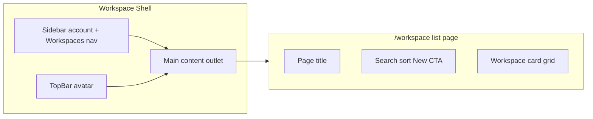

# Workspace Page Supabase-Style UI

## Design essence to extract

From the reference screenshot, apply these patterns to AgentFabric (mapping **Projects → Workspaces**):

| Supabase pattern | AgentFabric adaptation |
|---|---|
| Slim global top bar (avatar right) | Wire existing [`workspace-desktop-header.tsx`](web/src/features/workspace/layouts/workspace-desktop-header.tsx) with `UserAccountMenu variant="header"` |
| Sidebar: logo + account selector + single active nav | Replace workspace list in sidebar with account selector + **Workspaces** nav item |
| Full-width main panel (not narrow column) | Remove `max-w-2xl mx-auto` from [`workspace/index.tsx`](web/src/routes/_auth/workspace/index.tsx) |
| Large page title | `text-2xl font-semibold` "Workspaces" heading |
| Toolbar row | Search input, sort dropdown, primary **New workspace** CTA aligned right |
| Responsive card grid | 1 / 2 / 3 columns; dark bordered cards with name, slug subtitle, kebab menu |

No placeholder nav (Team, Billing, etc.) per your preference. No backend changes — search/sort are client-side over existing `useWorkspaces()` data.

## 1. Restructure workspace shell

**Edit:** [`web/src/features/workspace/layouts/index.tsx`](web/src/features/workspace/layouts/index.tsx)

Current shell lists every workspace in the sidebar and puts the user menu in the footer — opposite of the reference layout.

Changes:
- Switch sidebar from `variant="inset"` to `variant="sidebar"` for a flush, dashboard-like panel (dark theme tokens already exist in [`globals.css`](web/src/globals.css)).
- **Sidebar header:** compact logo link + new `WorkspaceAccountSelector` (user name/email, non-switching for now; menu can reuse theme/sign-out patterns or link to account settings later).
- **Sidebar content:** single nav group with one item — **Workspaces** (`IconFolders`) — `isActive` when route is `/workspace` or `/workspace/` (not when inside `$workspaceId`).
- **Remove** the mapped workspace list and "New Workspace" button from sidebar.
- **Remove** `UserAccountMenu` from sidebar footer.
- **Replace** the minimal inline header with composed headers:
  - Desktop: `WorkspaceDesktopHeader` (avatar right)
  - Mobile: `WorkspaceMobileHeader` (sidebar trigger + avatar)

## 2. Implement top bar components

**Edit:** [`web/src/features/workspace/layouts/workspace-desktop-header.tsx`](web/src/features/workspace/layouts/workspace-desktop-header.tsx)

Finish the existing stub:
- Full-width `h-12 border-b` bar spanning the main panel (not the sidebar).
- Left: optional breadcrumb/context only when on `$workspaceId` route (can stay minimal for this pass).
- Right: `UserAccountMenu variant="header"` fed by `meQueryOptions` (same as layout today).
- Leave Feedback / global search / help as commented stubs (no new features).

**New:** [`web/src/features/workspace/layouts/workspace-mobile-header.tsx`](web/src/features/workspace/layouts/workspace-mobile-header.tsx)

- `SidebarTrigger` + page context label ("Workspaces") + `UserAccountMenu variant="header"`.
- Visible only on mobile (`md:hidden`); desktop uses `WorkspaceDesktopHeader`.

## 3. Sidebar account selector

**New:** [`web/src/features/workspace/components/workspace-account-selector.tsx`](web/src/features/workspace/components/workspace-account-selector.tsx)

Supabase-style selector at top of sidebar:
- Trigger: user initials avatar + truncated name + chevron (fits `SidebarMenuButton size="lg"`).
- Dropdown content: name/email label, theme toggle, sign out (mirror [`user-account-menu.tsx`](web/src/features/auth/components/user-account-menu.tsx) menu groups — extract shared menu body if duplication is >10 lines, otherwise inline for minimal diff).
- Single-account display only (no switcher list).

## 4. Workspace list page — toolbar + grid

**Edit:** [`web/src/routes/_auth/workspace/index.tsx`](web/src/routes/_auth/workspace/index.tsx)

Replace the narrow vertical list with a dashboard-style list page.

**New:** [`web/src/features/workspace/components/workspace-list-toolbar.tsx`](web/src/features/workspace/components/workspace-list-toolbar.tsx)

Props: `search`, `onSearchChange`, `sort`, `onSortChange`, `onCreateClick`

Layout (matches screenshot rhythm):
- Row 1: `h1` "Workspaces"
- Row 2: flex toolbar
  - Left: search `Input` with `IconSearch` (`placeholder="Search for a workspace"`)
  - Middle: `Select` for sort (`Name A–Z`, `Name Z–A`, `Newest`, `Oldest`)
  - Right: `CreateWorkspaceDialog` trigger styled as primary CTA (`+ New workspace`)

Client-side filtering/sorting over `workspaces` array; no new API.

**New:** [`web/src/features/workspace/components/workspace-card.tsx`](web/src/features/workspace/components/workspace-card.tsx)

Grid card component:
- `Card` with `hover:border-foreground/20`, `cursor-pointer`, fixed min-height for grid uniformity.
- Header row: workspace initial badge + name (truncate) + `DropdownMenu` kebab (`Open`, optional future `Settings` disabled).
- Subtitle: slug in `text-muted-foreground text-sm`.
- Footer: `Badge` with `createdAt` formatted date (or member count if easily available later).
- `onClick` navigates to `/workspace/$workspaceId`.

Grid container: `grid grid-cols-1 md:grid-cols-2 xl:grid-cols-3 gap-4` inside `px-6 py-8` full-width wrapper.

**Loading state:** skeleton grid (6 cards) matching card dimensions.

**Empty state:** centered `Empty` below toolbar when filter returns 0 results vs when account has 0 workspaces (different copy).

## 5. Small dialog tweak

**Edit:** [`web/src/features/workspace/components/create-workspace-dialog.tsx`](web/src/features/workspace/components/create-workspace-dialog.tsx)

- Support optional `trigger` prop or `showTrigger={false}` so the toolbar can own the primary button label (`+ New workspace`) without duplicating dialog state.
- Keep existing dialog form/validation unchanged.

## 6. Workspace detail page (minimal)

**No structural redesign** of [`$workspaceId.index.tsx`](web/src/routes/_auth/workspace/$workspaceId.index.tsx) in this pass — it inherits the new shell (top bar + simplified sidebar). Optionally remove `max-w-3xl mx-auto` later for consistency; out of scope unless you want detail pages full-width too.

## Visual targets (Tailwind)

- Main content padding: `px-6 py-8` (spacious like reference)
- Page title: `text-2xl font-semibold tracking-tight`
- Toolbar gap: `gap-3`, search `max-w-xs`, sort `w-40`
- Cards: `rounded-lg border bg-card p-4`
- Primary CTA: existing `Button` default (green primary in dark mode)

## Manual verification

1. `/workspace` — full-width grid, toolbar search filters cards live, sort reorders, **New workspace** opens dialog and refreshes grid.
2. Sidebar shows account selector + **Workspaces** (active); no per-workspace sidebar links.
3. Top bar avatar menu works (theme toggle, sign out).
4. Mobile — sidebar sheet + compact top bar; grid collapses to 1 column.
5. Click card / kebab "Open" navigates to workspace detail.
6. Empty account and no-search-results states render correctly.

## Files summary

| Action | Path |
|--------|------|
| Edit | `web/src/features/workspace/layouts/index.tsx` |
| Edit | `web/src/features/workspace/layouts/workspace-desktop-header.tsx` |
| New | `web/src/features/workspace/layouts/workspace-mobile-header.tsx` |
| New | `web/src/features/workspace/components/workspace-account-selector.tsx` |
| New | `web/src/features/workspace/components/workspace-list-toolbar.tsx` |
| New | `web/src/features/workspace/components/workspace-card.tsx` |
| Edit | `web/src/routes/_auth/workspace/index.tsx` |
| Edit | `web/src/features/workspace/components/create-workspace-dialog.tsx` |
