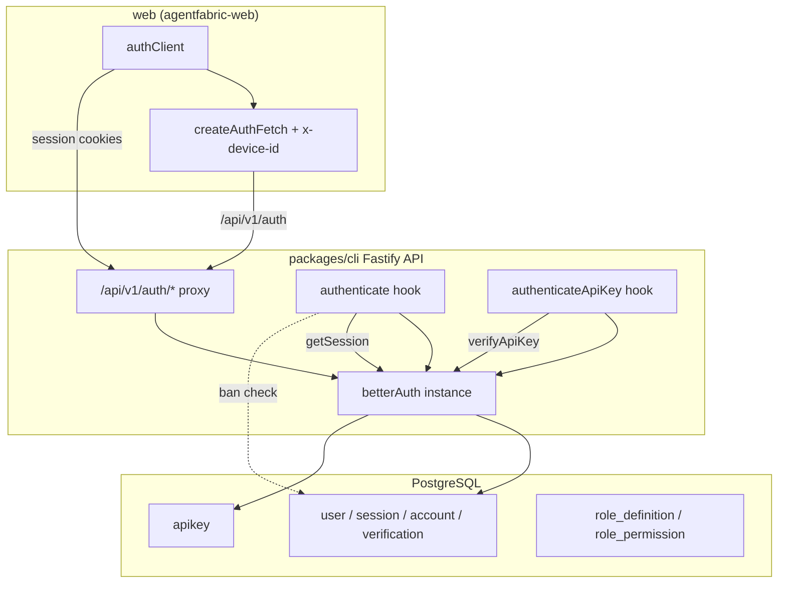

# Better Auth Configuration Analysis

This document audits the AgentFabric Better Auth integration against the official Better Auth documentation (v1.6.x), covering server configuration, client configuration, database schema, plugin options, and custom extensions.

**Audit date:** 2026-06-05  
**Packages reviewed:** `packages/cli`, `web`, `packages/cli/migrations`

## Executive Summary

| Area | Status | Notes |
|------|--------|-------|
| Core Better Auth setup | ✅ Correct | Drizzle adapter, required env vars, custom `basePath` |
| Email/password auth | ✅ Correct | Enabled; verification intentionally disabled |
| Admin plugin | ✅ Mostly correct | Default options match docs; custom roles need follow-up |
| API Key plugin | ✅ Correct | Dual `configId` setup matches official advanced example |
| Database schema / migrations | ✅ Correct | All plugin-required columns present |
| Web auth client | ✅ Correct | Plugin parity with server (`adminClient`, `apiKeyClient`) |
| Custom API key auth (Bearer) | ⚠️ Intentional deviation | Uses `Authorization: Bearer` instead of `x-api-key` |
| Package version alignment | ⚠️ Minor mismatch | `better-auth@1.6.9` vs `@better-auth/api-key@1.6.10` |
| Custom role system | ⚠️ Partial integration | `role_definition` tables are app-level, not wired into Better Auth AC |
| Production hardening | ⚠️ Gaps | No `trustedOrigins`, email verification off, debug logs on verify |

**Overall verdict:** The Better Auth plugin configuration is **correct and aligned with documentation**. AgentFabric adds deliberate layers on top (session governance, Bearer-based API key routes, custom role registry) that are valid but should be understood when extending auth.

---

## Architecture



### Request paths

| Auth mechanism | Entry point | Better Auth API used |
|----------------|-------------|----------------------|
| Browser session (cookie) | `fastify.authenticate` | `auth.api.getSession()` |
| API key (programmatic) | `fastify.authenticateApiKey` | `auth.api.verifyApiKey()` |
| Auth CRUD (sign-in, keys, admin) | `/api/v1/auth/*` proxy | `auth.handler()` |

---

## Server Configuration

**File:** `packages/cli/src/lib/auth.ts`

```typescript
const config = {
  basePath: "/api/v1/auth",
  baseURL: betterAuthBaseUrl,       // BETTER_AUTH_BASE_URL
  secret: betterAuthSecret,         // BETTER_AUTH_SECRET
  database: drizzleAdapter(db, { provider: "pg" }),
  emailAndPassword: {
    enabled: true,
    requireEmailVerification: false,
  },
  plugins: [
    admin({ adminRoles: ["admin"], defaultRole: "user" }),
    apiKey([
      { configId: "public", defaultPrefix: "pk_", ... },
      { configId: "secret", defaultPrefix: "sk_", enableMetadata: true, ... },
    ]),
  ],
} satisfies BetterAuthOptions;
```

### Required environment variables

| Variable | Used for | Doc reference |
|----------|----------|---------------|
| `DATABASE_URL` | Drizzle adapter / Postgres | [Drizzle adapter](https://www.better-auth.com/docs/adapters/drizzle) |
| `BETTER_AUTH_SECRET` | Session/token signing | Core Better Auth config |
| `BETTER_AUTH_BASE_URL` | Callback URLs, cookie domain | Core Better Auth config |

All three are validated at module load via `requireEnv()` — startup fails fast if missing. This matches Better Auth requirements.

### Drizzle adapter

| Setting | AgentFabric | Documentation | Verdict |
|---------|-------------|---------------|---------|
| `provider` | `"pg"` | Required for PostgreSQL | ✅ |
| `schema` override | Not passed; uses `db` instance schema | Optional when table names differ | ✅ |
| DB instance | `drizzle(postgresClient, { schema })` in `db/index.ts` | Adapter reads attached schema | ✅ |

The adapter auto-discovers `user`, `session`, `account`, `verification`, and `apikey` from `packages/cli/src/schema.ts`. Table export names match Better Auth defaults (`user`, not `users`).

### `basePath` and routing

| Component | Value |
|-----------|-------|
| Server `basePath` | `/api/v1/auth` |
| Fastify auth route prefix | `/api` → `/v1/auth/*` |
| Web client `basePath` | `/api/v1/auth` |

All three are consistent. Better Auth handlers receive requests at the configured `basePath`.

---

## Plugin Analysis

### 1. Email and Password

| Option | Value | Doc default | Verdict |
|--------|-------|-------------|---------|
| `enabled` | `true` | — | ✅ |
| `requireEmailVerification` | `false` | `false` | ✅ (dev-friendly; enable for production) |

Sign-in is handled by the auth proxy at paths ending in `/sign-in/email`. Session governance hooks run around successful email sign-in (see [Session Governance](#session-governance-extension)).

### 2. Admin Plugin

**Server:** `admin({ adminRoles: ["admin"], defaultRole: "user" })`  
**Client:** `adminClient()` in `web/src/lib/auth.ts`

| Option | Value | Doc default | Verdict |
|--------|-------|-------------|---------|
| `adminRoles` | `["admin"]` | `["admin"]` | ✅ |
| `defaultRole` | `"user"` | `"user"` | ✅ |
| Custom access control (`ac`, `roles`) | Not configured | Optional | ⚠️ See custom roles section |

**Database fields added by admin plugin** (present in migration `0000`):

| Table | Field | Present |
|-------|-------|---------|
| `user` | `role` | ✅ |
| `user` | `banned`, `ban_reason`, `ban_expires` | ✅ |
| `session` | `impersonated_by` | ✅ |

**Client usage (verified in test routes):**

- `authClient.admin.impersonateUser({ userId })`
- `authClient.admin.stopImpersonating()`

**Server-side admin enforcement:**

- `packages/cli/src/server/hooks/authenticate.ts` — rejects banned users (403), auto-clears expired bans
- `packages/cli/src/server/routes/v1/management/route.ts` — `ensureAdmin()` checks `request.user?.role === "admin"`

**Gaps:**

1. **`/bootstrap-admin` bypasses Better Auth APIs** — promotes user by direct DB `UPDATE` instead of `auth.api.setRole()`. Works for the `role` column but skips any admin-plugin hooks.
2. **Custom roles vs admin plugin** — `role_definition` / `role_permission` (migration `0001`) are application tables. Without `ac` + `roles` in the admin plugin, Better Auth admin APIs only treat `admin` and `user` as first-class roles. Custom roles (e.g. `manager`) can be stored on `user.role` via `setRole`, but they do **not** automatically receive admin-plugin permissions unless added to `adminRoles` or defined via custom access control.

### 3. API Key Plugin

**Server:** `apiKey([...])` from `@better-auth/api-key`  
**Client:** `apiKeyClient()` from `@better-auth/api-key/client`

This matches the [multiple configurations](https://www.better-auth.com/docs/plugins/api-key/advanced) pattern from Better Auth docs.

#### Configuration comparison

| Option | `public` config | `secret` config | Doc reference |
|--------|-----------------|-----------------|---------------|
| `configId` | `"public"` | `"secret"` | Required for multi-config ✅ |
| `defaultPrefix` | `"pk_"` | `"sk_"` | Docs recommend trailing `_` ✅ |
| `enableSessionForAPIKeys` | `false` | `false` | Default `false` ✅ |
| `enableMetadata` | not set (false) | `true` | Per-config option ✅ |
| `rateLimit.enabled` | `true` | `true` | ✅ |
| `rateLimit.maxRequests` | `100` | `1000` | ✅ |
| `rateLimit.timeWindow` | `3_600_000` ms (1 h) | `3_600_000` ms (1 h) | Milliseconds per docs ✅ |

#### `configId` inference

`packages/cli/src/lib/api-key-config.ts` maps prefixes to config IDs:

| Prefix | `configId` |
|--------|------------|
| `pk_` | `public` |
| `sk_` | `secret` |

Used by:

- `authenticate-api-key.ts` — passes `configId` to `verifyApiKey`
- `auth/route.ts` — compatibility verify endpoint

This aligns with Better Auth guidance to pass `configId` when multiple configurations exist.

#### `enableSessionForAPIKeys: false` (intentional)

Better Auth can mock a user session when a valid key is found in the `x-api-key` header. AgentFabric disables this and instead:

1. Verifies keys explicitly via `auth.api.verifyApiKey()`
2. Populates `request.apiKey` (not `request.user`)
3. Uses `Authorization: Bearer <key>` on protected routes (e.g. `/api/v1/table`)

This is a **valid architectural choice** for machine-to-machine APIs. It avoids double rate-limit counting (documented in Better Auth advanced docs) and keeps session and API-key auth paths separate.

#### Default header: `x-api-key` vs Bearer

| Mechanism | Better Auth default | AgentFabric |
|-----------|---------------------|-------------|
| Session mocking header | `x-api-key` | Disabled |
| Protected route auth | — | `Authorization: Bearer` |

Programmatic clients must send Bearer tokens to AgentFabric API routes. The Better Auth verify endpoint (`POST /api/v1/auth/api-key/verify`) accepts `{ key, configId?, permissions? }` in the body regardless of header format.

---

## Web Client Configuration

**File:** `web/src/lib/auth.ts`

```typescript
export const authClient = createAuthClient({
  baseURL,                          // VITE_API_BASE_URL || http://localhost:5678
  basePath: "/api/v1/auth",
  plugins: [adminClient(), apiKeyClient()],
  fetchOptions: {
    customFetchImpl: createAuthFetch(baseURL),
  },
})
```

| Setting | Server | Client | Verdict |
|---------|--------|--------|---------|
| `basePath` | `/api/v1/auth` | `/api/v1/auth` | ✅ |
| `baseURL` | `BETTER_AUTH_BASE_URL` | `VITE_API_BASE_URL` | ✅ (must point to same origin in prod) |
| Admin plugin client | `admin()` | `adminClient()` | ✅ |
| API key plugin client | `apiKey()` | `apiKeyClient()` | ✅ |

### Device ID interceptor

`web/src/lib/auth-fetch-interceptor.ts` injects `x-device-id` on auth requests. This is an AgentFabric extension documented in `docs/DEVICE_ID_INTEGRATION.md`, not part of Better Auth core. The server auth proxy forwards this header to Better Auth and tags sessions after sign-in.

### API key client usage

Verified in `web/src/routes/test-api-playground.tsx`:

```typescript
await authClient.apiKey.create({
  configId: selectedConfigId,  // "public" | "secret"
  name, prefix, expiresIn, metadata,
})
```

Creation requires an authenticated session (user-owned keys, `references: "user"` default). Metadata is only passed for the `secret` config, matching server `enableMetadata: true` on that config only.

---

## Database Schema and Migrations

### Migration `0000_tricky_edwin_jarvis.sql`

Core Better Auth tables:

| Table | Purpose | Plugin |
|-------|---------|--------|
| `user` | User accounts | Core + Admin |
| `session` | Active sessions | Core + Admin |
| `account` | Provider credentials (email/password) | Core |
| `verification` | Email verification tokens | Core |
| `apikey` | Hashed API keys | API Key |

#### `apikey` table field audit

All fields from the [API Key plugin schema reference](https://www.better-auth.com/docs/plugins/api-key/reference) are present:

`id`, `config_id`, `name`, `start`, `prefix`, `key`, `reference_id`, `refill_interval`, `refill_amount`, `last_refill_at`, `enabled`, `rate_limit_enabled`, `rate_limit_time_window`, `rate_limit_max`, `request_count`, `remaining`, `last_request`, `expires_at`, `created_at`, `updated_at`, `permissions`, `metadata`

Drizzle schema in `packages/cli/src/schema.ts` uses camelCase property names mapped to snake_case columns — standard Drizzle convention, compatible with the adapter.

### Migration `0001_outstanding_mystique.sql`

Application-level RBAC tables (not generated by Better Auth):

| Table | Purpose |
|-------|---------|
| `role_definition` | Named roles (`manager`, `viewer`, etc.) |
| `role_permission` | Permissions per role |

These support the management API (`/api/v1/management/roles`) but are **not** integrated into Better Auth's admin plugin access-control system unless `ac` and `roles` are added to the admin plugin config.

### Custom session field

| Field | Table | Source |
|-------|-------|--------|
| `device_id` | `session` | AgentFabric session governance |

Better Auth does not define this field; it is a safe schema extension stored alongside standard session columns.

---

## Fastify Integration

### Auth plugin

`packages/cli/src/server/plugins/auth.ts` decorates Fastify with the shared `auth` instance. All hooks and routes use `fastify.auth`.

### Auth proxy route

`packages/cli/src/server/routes/v1/auth/route.ts`:

1. Intercepts `POST .../api-key/verify` for compatibility (returns `verifyApiKey` result)
2. Applies session governance on email sign-in
3. Forwards `x-forwarded-for` and `x-device-id` to Better Auth
4. Proxies to `auth.handler(new Request(...))`
5. Returns response headers and body (including `Set-Cookie`)

Rate limit: 20 requests/minute per IP on auth routes (tighter than global `/api` limit).

### Authentication hooks

| Hook | File | Better Auth API | Populates |
|------|------|-----------------|-----------|
| `authenticate` | `hooks/authenticate.ts` | `getSession()` | `request.user`, `request.session` |
| `authenticateApiKey` | `hooks/authenticate-api-key.ts` | `verifyApiKey()` | `request.apiKey` |
| `rejectAuthenticated` | `hooks/reject-authenticated.ts` | `getSession()` | — (early 200 if session exists) |

### Protected route examples

| Route | Auth | Config |
|-------|------|--------|
| `/api/v1/example` | Session (`authenticate`) | — |
| `/api/v1/table` | API key (`authenticateApiKey`) | Bearer token |
| `/api/v1/management/*` | Session + role checks | Admin for write ops |

---

## Session Governance Extension

AgentFabric session policy is **outside** Better Auth and implemented in the auth proxy. See `packages/cli/src/lib/auth-session-policy.ts` and `docs/DEVICE_ID_INTEGRATION.md`.

| Env variable | Default | Purpose |
|--------------|---------|---------|
| `AGENTFABRIC_AUTH_SESSION_POLICY_MODE` | `max-sessions` | `keep-latest` \| `block-new-login` \| `max-sessions` |
| `AGENTFABRIC_AUTH_MAX_SESSIONS` | `5` | Global per-user cap |
| `AGENTFABRIC_AUTH_MAX_SESSIONS_PER_DEVICE` | `2` | Per `device_id` cap |
| `AGENTFABRIC_AUTH_MAX_SESSIONS_PER_IP` | `5` | Per IP cap |

This does not conflict with Better Auth; it runs after successful sign-in (or blocks before proxying in `block-new-login` mode).

---

## Issues and Recommendations

### 1. Package version alignment (recommended)

```
better-auth:          1.6.9  (pnpm catalog)
@better-auth/api-key: 1.6.10 (direct dep)
```

`@better-auth/api-key@1.6.10` declares peer `better-auth@^1.6.10`. Align both to `1.6.10` in `pnpm-workspace.yaml` catalog to avoid subtle API/type drift.

### 2. Add `trustedOrigins` for cross-origin deployments (recommended for production)

Not currently set in `auth.ts`. If the web app is served from a different origin than `BETTER_AUTH_BASE_URL`, configure:

```typescript
trustedOrigins: [process.env.BETTER_AUTH_TRUSTED_ORIGIN ?? betterAuthBaseUrl],
```

Required when frontend and API run on different hosts without the Fastify dev proxy.

### 3. Enable email verification for production (recommended)

`requireEmailVerification: false` is fine for local development. Enable before production launch.

### 4. Remove or gate API key verify debug logs (recommended)

`auth/route.ts` logs full request body and verification results at `info` level. Redact or restrict to debug in production to avoid leaking key material in logs.

### 5. Unify admin bootstrap with Better Auth API (optional)

`/api/v1/management/bootstrap-admin` updates `user.role` directly. Prefer `auth.api.setRole()` for consistency with admin plugin behavior.

### 6. Integrate custom roles with Better Auth access control (future)

To make `role_definition` permissions enforceable through Better Auth admin APIs:

```typescript
import { createAccessControl } from "better-auth/plugins/access";

const ac = createAccessControl({ /* resources */ });

admin({
  ac,
  roles: { admin, manager, user },
  // adminRoles optional when using custom AC
})
```

Until then, custom roles are enforced only by AgentFabric management routes, not by `authClient.admin.*` methods.

### 7. Document Bearer convention for API consumers (done here)

External integrators should use:

```http
GET /api/v1/table?name=session
Authorization: Bearer sk_...
```

Not the Better Auth default `x-api-key` header (unless `enableSessionForAPIKeys` is enabled).

---

## Configuration Checklist

Use this when changing auth settings:

- [ ] Server `basePath` matches Fastify route prefix and web `basePath`
- [ ] `BETTER_AUTH_BASE_URL` matches the public URL clients use for cookies
- [ ] `VITE_API_BASE_URL` (web) resolves to the same API origin in production
- [ ] Server plugins have matching client plugins (`admin` ↔ `adminClient`, `apiKey` ↔ `apiKeyClient`)
- [ ] Each `apiKey` `configId` on server has a corresponding prefix in `api-key-config.ts`
- [ ] New Better Auth plugin fields are added via `npx auth@latest generate` or manual migration
- [ ] Drizzle schema export names match Better Auth model names (or pass `schema` to adapter)
- [ ] Rate limit `timeWindow` values are in **milliseconds**

---

## File Reference

| File | Role |
|------|------|
| `packages/cli/src/lib/auth.ts` | Better Auth server config |
| `packages/cli/src/schema.ts` | Drizzle schema (Better Auth + extensions) |
| `packages/cli/migrations/0000_*.sql` | Core + API key tables |
| `packages/cli/migrations/0001_*.sql` | Custom RBAC tables |
| `packages/cli/src/lib/api-key-config.ts` | Prefix → `configId` mapping |
| `packages/cli/src/lib/auth-session-policy.ts` | Session governance config |
| `packages/cli/src/server/routes/v1/auth/route.ts` | Auth proxy + verify compat |
| `packages/cli/src/server/hooks/authenticate.ts` | Session auth hook |
| `packages/cli/src/server/hooks/authenticate-api-key.ts` | API key auth hook |
| `web/src/lib/auth.ts` | Better Auth client |
| `web/src/lib/auth-fetch-interceptor.ts` | Device ID injection |

---

## Related Documentation

- [DEVICE_ID_INTEGRATION.md](./DEVICE_ID_INTEGRATION.md) — client device ID and session limits
- [implementation_detail.md](./implementation_detail.md) — broader platform architecture
- [Better Auth docs](https://www.better-auth.com/docs/introduction) — upstream reference
