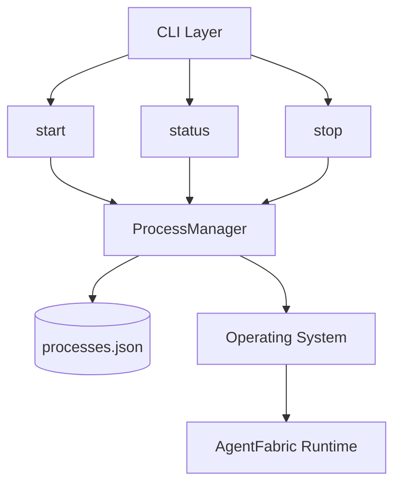
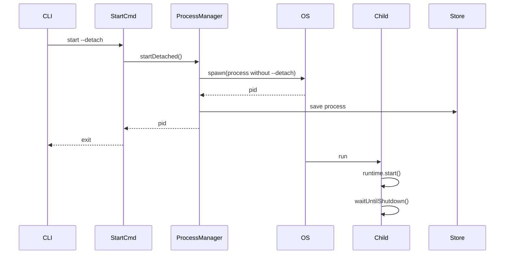
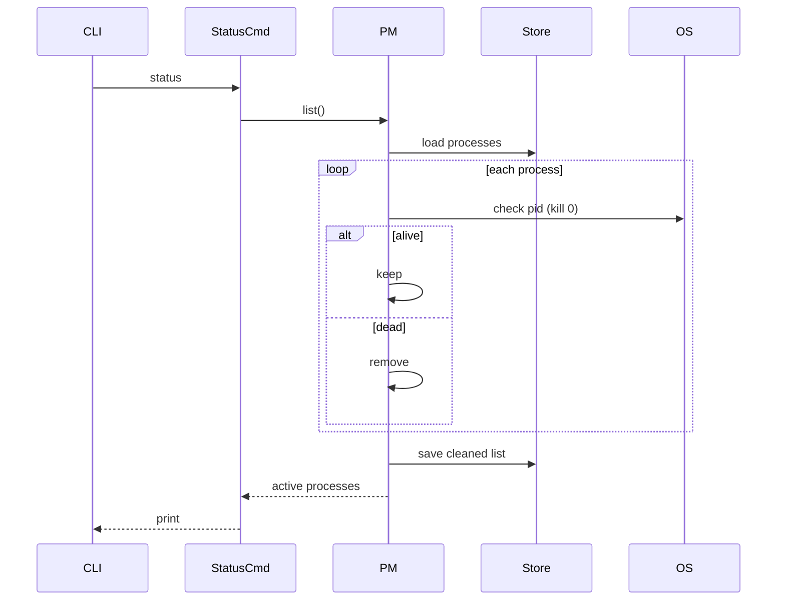
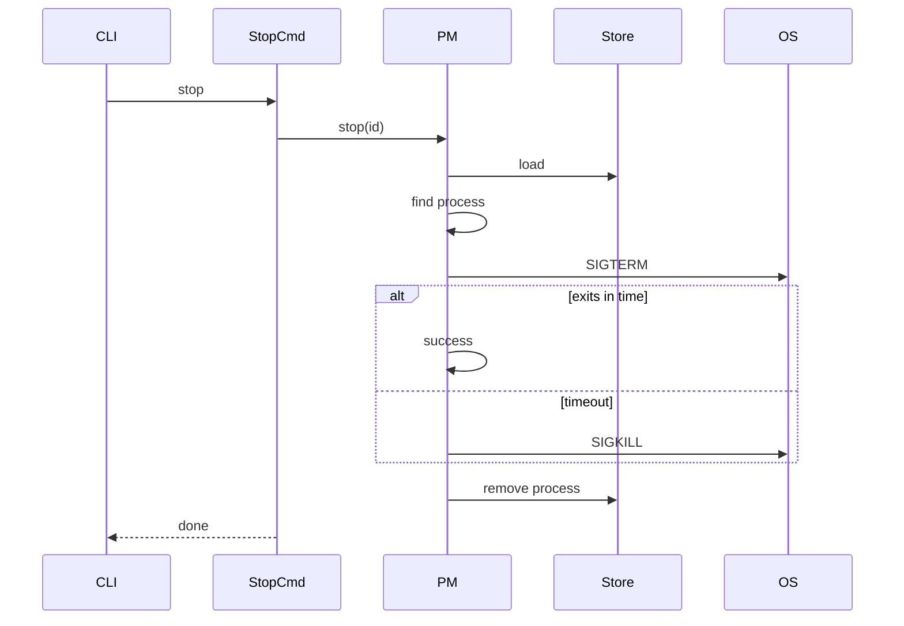
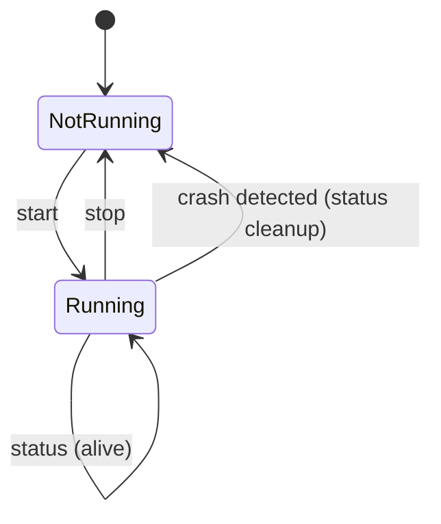

# AgentFabric CLI – Process Lifecycle Management

AgentFabric CLI provides a minimal process management layer for running, monitoring, and controlling the AgentFabric runtime.

It supports:

* Detached process execution
* Process status inspection (self-healing)
* Graceful and forced shutdown
* Active process registry (no stale state)

## API Auth Setup

The CLI API server now integrates Better Auth through the workspace auth package.

Required environment variables:

* DATABASE_URL: PostgreSQL connection string used by the auth adapter.
* BETTER_AUTH_SECRET: Secret used by Better Auth to sign and validate auth data.
* BETTER_AUTH_BASE_URL: Public base URL used by Better Auth for callback and cookie domain handling.

Optional session policy variables:

* AGENTFABRIC_AUTH_SESSION_POLICY_MODE: Session policy mode. Supported values: keep-latest, block-new-login, max-sessions. Default: max-sessions.
* AGENTFABRIC_AUTH_MAX_SESSIONS: Maximum number of active sessions per user for block-new-login and max-sessions modes. Must be an integer >= 1. Default: 5.
* AGENTFABRIC_AUTH_MAX_SESSIONS_PER_DEVICE: Maximum active sessions allowed per user and device identifier. Must be an integer >= 1. Default: 2.
* AGENTFABRIC_AUTH_MAX_SESSIONS_PER_IP: Maximum active sessions allowed per user and IP address. Must be an integer >= 1. Default: 5.

## Session Governance

AgentFabric enforces multi-layered session governance to prevent excessive concurrent sessions:

### Policy Modes

- **keep-latest**: Only 1 session per user. New sign-in invalidates all previous sessions.
- **block-new-login**: Reject sign-in attempts when max sessions reached; user must log out from existing session first.
- **max-sessions**: Allow up to max sessions per user; when limit is reached, prune oldest sessions on new sign-in.

### Device & IP-Based Limits

Sessions are additionally governed by device ID and IP address:
- **Per-Device Limit** (AGENTFABRIC_AUTH_MAX_SESSIONS_PER_DEVICE): Max concurrent sessions from the same device.
- **Per-IP Limit** (AGENTFABRIC_AUTH_MAX_SESSIONS_PER_IP): Max concurrent sessions from the same IP address.

To enable device tracking, clients should send a stable device identifier on sign-in requests:

* Header: `x-device-id`
* Body field: `deviceId`

The device ID is stored in the `session.device_id` column for tracking and governance.

Auth routes are exposed at:

* /api/v1/auth/*

Protected route example:

* /api/v1/example (requires a valid authenticated session)

---

# 🧠 Design Principles

* **Single Source of Truth** → OS (PID), not local state
* **Active State Only** → No historical/stopped entries in registry
* **Self-Healing** → Status command cleans stale processes
* **Separation of Concerns** → Runtime ≠ Process Management

---

# 🏗 High-Level Design (HLD)

## Architecture Overview



---

## Responsibilities

| Component          | Responsibility                      |
| ------------------ | ----------------------------------- |
| CLI Commands       | User interaction                    |
| ProcessManager     | Process lifecycle orchestration     |
| ProcessStore       | Persistence (active processes only) |
| OS                 | Source of truth (PID lifecycle)     |
| AgentFabricRuntime | Application service lifecycle       |

---

# 🔄 Command Lifecycle Flows

## Start (Detached Mode)



---

## Status (Self-Healing)



---

## Stop (Graceful → Force → Cleanup)



---

# 🔁 State Model



---

# 🧩 Low-Level Design (LLD)

## Data Model

```ts
type ProcessRecord = {
  id: string;
  pid: number;
  command: string;
  args: string[];
  startedAt: number;
};
```

> Only **active processes** are stored.

---

## ProcessStore

```ts
class ProcessStore {
  load(): ProcessRecord[]
  save(processes: ProcessRecord[]): void
  add(record: ProcessRecord): void
  remove(id: string): void
}
```

### Storage Location

```bash
~/.agentfabric/processes.json
```

---

## ProcessManager

```ts
class ProcessManager {
  startDetached(args: string[]): number
  list(): ProcessRecord[]
  stop(id: string, force?: boolean): void
  private isAlive(pid: number): boolean
}
```

---

## Key Algorithms

### PID Validation

```ts
process.kill(pid, 0)
```

* does NOT kill process
* checks existence via OS

---

### Self-Healing Registry

```ts
aliveProcesses = processes.filter(isAlive)
save(aliveProcesses)
```

---

### Graceful Shutdown

```ts
SIGTERM → wait → SIGKILL (fallback)
```

---

# ⚙️ Runtime Layer

```ts
class AgentFabricRuntime {
  register(service)
  start()
  stop()
}
```

### Characteristics

* In-process lifecycle only
* No knowledge of PID / registry
* Triggered via signals

---

# 📦 CLI Commands

## Start

```bash
agentfabric start
agentfabric start --detach
```

---

## Status

```bash
agentfabric status
agentfabric status --json
```

---

## Stop

```bash
agentfabric stop
agentfabric stop --force
agentfabric stop --id <name>
```

---

# 📌 Design Guarantees

### ✅ No Stale State

* Dead processes automatically removed

### ✅ Accurate Status

* Always validated against OS

### ✅ No Uptime Drift

* Only running processes tracked

### ✅ Deterministic Lifecycle

```text
start → create
stop → remove
status → reconcile
```

---

# ⚠️ Known Limitations

### PID Reuse

OS may reuse PIDs → rare false positives

### No Multi-Instance Isolation (yet)

Currently uses:

```ts
id: "default"
```

---

# 🚀 Future Enhancements

## Process Management

* Named processes (`--name`)
* Restart command
* Health checks

## Observability

* File-based logs
* SQLite-backed logs & history
* Fastify uses Pino for server logs, with `pino-pretty` in development and structured JSON in production
* HTTP request and error logs are persisted to Postgres in `server_log`, which can be queried from Grafana

## Reliability

* PID + start-time validation
* IPC-based health checks

---

# 🧱 Suggested Folder Structure

```bash
/process
  process-manager.ts
  process-store.ts
  process-types.ts

/commands
  start.ts
  status.ts
  stop.ts

/runtime
  agentfabric-runtime.ts
```

---

# 🧭 Summary

AgentFabric CLI implements a **minimal, reliable process control plane**:

* ProcessManager orchestrates lifecycle
* ProcessStore persists active state
* OS is the source of truth
* Runtime executes business logic

This separation ensures the system remains **extensible, debuggable, and production-ready**.
