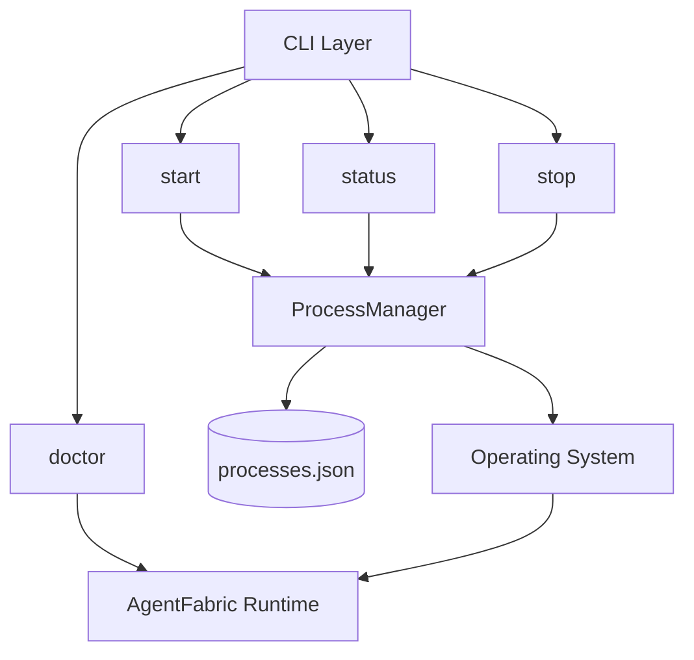
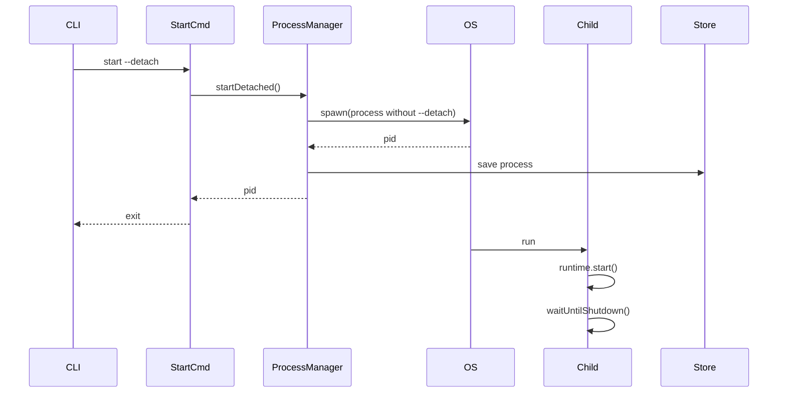
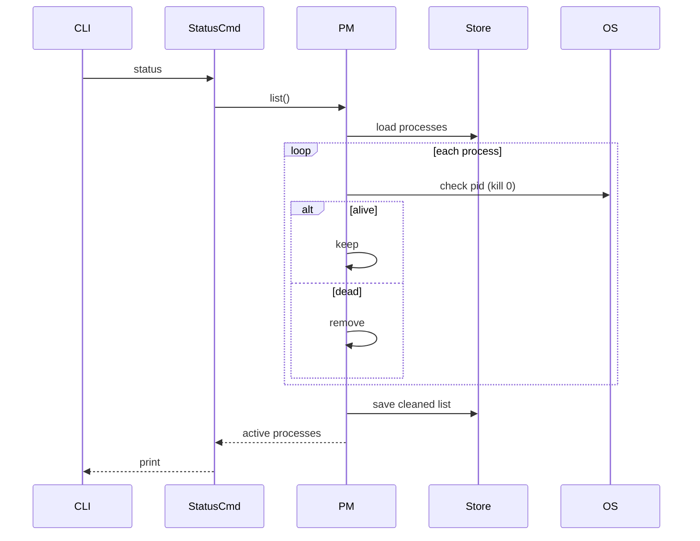
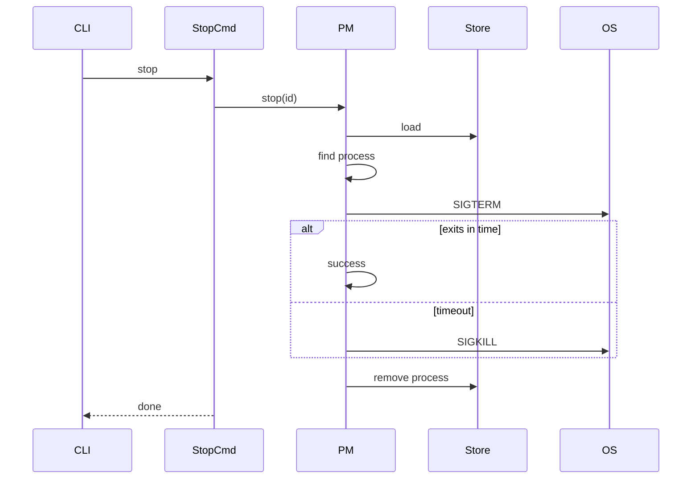
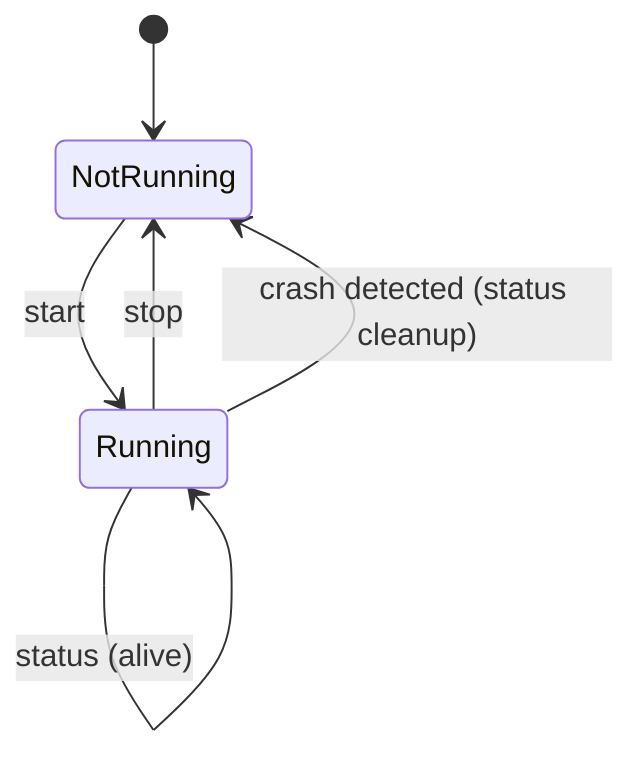

# AgentFabric CLI – Process Lifecycle Management

AgentFabric CLI provides a minimal process management layer for running, monitoring, and controlling the AgentFabric runtime.

It supports:

* Detached process execution
* Process status inspection (self-healing)
* Graceful and forced shutdown
* Active process registry (no stale state)

## API Auth Setup

The CLI API server now integrates Better Auth through the workspace auth package.

Required environment variables:

* DATABASE_URL: PostgreSQL connection string used by the auth adapter.
* BETTER_AUTH_SECRET: Secret used by Better Auth to sign and validate auth data.
* BETTER_AUTH_BASE_URL: Public base URL used by Better Auth for callback and cookie domain handling.

Optional session policy variables:

* AGENTFABRIC_AUTH_SESSION_POLICY_MODE: Session policy mode. Supported values: keep-latest, block-new-login, max-sessions. Default: max-sessions.
* AGENTFABRIC_AUTH_MAX_SESSIONS: Maximum number of active sessions per user for block-new-login and max-sessions modes. Must be an integer >= 1. Default: 5.
* AGENTFABRIC_AUTH_MAX_SESSIONS_PER_DEVICE: Maximum active sessions allowed per user and device identifier. Must be an integer >= 1. Default: 2.
* AGENTFABRIC_AUTH_MAX_SESSIONS_PER_IP: Maximum active sessions allowed per user and IP address. Must be an integer >= 1. Default: 5.

## Session Governance

AgentFabric enforces multi-layered session governance to prevent excessive concurrent sessions:

### Policy Modes

- **keep-latest**: Only 1 session per user. New sign-in invalidates all previous sessions.
- **block-new-login**: Reject sign-in attempts when max sessions reached; user must log out from existing session first.
- **max-sessions**: Allow up to max sessions per user; when limit is reached, prune oldest sessions on new sign-in.

### Device & IP-Based Limits

Sessions are additionally governed by device ID and IP address:
- **Per-Device Limit** (AGENTFABRIC_AUTH_MAX_SESSIONS_PER_DEVICE): Max concurrent sessions from the same device.
- **Per-IP Limit** (AGENTFABRIC_AUTH_MAX_SESSIONS_PER_IP): Max concurrent sessions from the same IP address.

To enable device tracking, clients should send a stable device identifier on sign-in requests:

* Header: `x-device-id`
* Body field: `deviceId`

The device ID is stored in the `session.device_id` column for tracking and governance.

Auth routes are exposed at:

* /api/v1/auth/*

Protected route example:

* /api/v1/example (requires a valid authenticated session)

---

# 🧠 Design Principles

* **Single Source of Truth** → OS (PID), not local state
* **Active State Only** → No historical/stopped entries in registry
* **Self-Healing** → Status command cleans stale processes
* **Separation of Concerns** → Runtime ≠ Process Management

---

# 🏗 High-Level Design (HLD)

## Architecture Overview


```mermaid
flowchart TD
    CLI[CLI Layer]

    Start[start]
    Status[status]
    Stop[stop]
    Doctor[doctor]

    PM[ProcessManager]
    Store[(processes.json)]
    OS[Operating System]
    Runtime[AgentFabric Runtime]

    CLI --> Start
    CLI --> Status
    CLI --> Stop
    CLI --> Doctor

    Start --> PM
    Status --> PM
    Stop --> PM

    Doctor --> Runtime

    PM --> Store
    PM --> OS

    OS --> Runtime
```

---

## Responsibilities

| Component          | Responsibility                      |
| ------------------ | ----------------------------------- |
| CLI Commands       | User interaction                    |
| ProcessManager     | Process lifecycle orchestration     |
| ProcessStore       | Persistence (active processes only) |
| OS                 | Source of truth (PID lifecycle)     |
| AgentFabricRuntime | Application service lifecycle       |

---

# 🔄 Command Lifecycle Flows

## Start (Detached Mode)


```mermaid
sequenceDiagram
    participant CLI
    participant StartCmd
    participant PM as ProcessManager
    participant OS
    participant Child
    participant Store

    CLI->>StartCmd: start --detach
    StartCmd->>PM: startDetached()

    PM->>OS: spawn(process without --detach)
    OS-->>PM: pid

    PM->>Store: save process

    PM-->>StartCmd: pid
    StartCmd-->>CLI: exit

    OS->>Child: run
    Child->>Child: runtime.start()
    Child->>Child: waitUntilShutdown()
```

---

## Status (Self-Healing)


```mermaid
sequenceDiagram
    participant CLI
    participant StatusCmd
    participant PM
    participant Store
    participant OS

    CLI->>StatusCmd: status
    StatusCmd->>PM: list()

    PM->>Store: load processes

    loop each process
        PM->>OS: check pid (kill 0)
        alt alive
            PM->>PM: keep
        else dead
            PM->>PM: remove
        end
    end

    PM->>Store: save cleaned list

    PM-->>StatusCmd: active processes
    StatusCmd-->>CLI: print
```

---

## Stop (Graceful → Force → Cleanup)


```mermaid
sequenceDiagram
    participant CLI
    participant StopCmd
    participant PM
    participant Store
    participant OS

    CLI->>StopCmd: stop
    StopCmd->>PM: stop(id)

    PM->>Store: load
    PM->>PM: find process

    PM->>OS: SIGTERM

    alt exits in time
        PM->>PM: success
    else timeout
        PM->>OS: SIGKILL
    end

    PM->>Store: remove process

    StopCmd-->>CLI: done
```

---

# 🔁 State Model


```mermaid
stateDiagram-v2
    [*] --> NotRunning

    NotRunning --> Running: start

    Running --> Running: status (alive)

    Running --> NotRunning: stop
    Running --> NotRunning: crash detected (status cleanup)
```

---

# 🧩 Low-Level Design (LLD)

## Data Model

```ts
type ProcessRecord = {
  id: string;
  pid: number;
  command: string;
  args: string[];
  startedAt: number;
};
```

> Only **active processes** are stored.

---

## ProcessStore

```ts
class ProcessStore {
  load(): ProcessRecord[]
  save(processes: ProcessRecord[]): void
  add(record: ProcessRecord): void
  remove(id: string): void
}
```

### Storage Location

```bash
~/.agentfabric/processes.json
```

---

## ProcessManager

```ts
class ProcessManager {
  startDetached(args: string[]): number
  list(): ProcessRecord[]
  stop(id: string, force?: boolean): void
  private isAlive(pid: number): boolean
}
```

---

## Key Algorithms

### PID Validation

```ts
process.kill(pid, 0)
```

* does NOT kill process
* checks existence via OS

---

### Self-Healing Registry

```ts
aliveProcesses = processes.filter(isAlive)
save(aliveProcesses)
```

---

### Graceful Shutdown

```ts
SIGTERM → wait → SIGKILL (fallback)
```

---

# ⚙️ Runtime Layer

```ts
class AgentFabricRuntime {
  register(service)
  start()
  stop()
}
```

### Characteristics

* In-process lifecycle only
* No knowledge of PID / registry
* Triggered via signals

---

# 📦 CLI Commands

## Start

```bash
agentfabric start
agentfabric start --detach
```

---

## Status

```bash
agentfabric status
agentfabric status --json
```

---

## Stop

```bash
agentfabric stop
agentfabric stop --force
agentfabric stop --id <name>
```

---

## Doctor

Inspect configuration readiness before starting the runtime. Use this command after setting environment variables and applying database migrations, but before `agentfabric start`.

```bash
agentfabric doctor
agentfabric doctor --json
agentfabric doctor --strict
NODE_ENV=development agentfabric doctor --dotenv
```

| Flag | Description |
|------|-------------|
| `--json` | Output the full report as JSON |
| `--strict` | Exit with code 1 on warnings as well as failures |
| `--dotenv` | Load `.env` from the current directory (development only; rejected in production) |

Exit code `1` when any check fails, or when `--strict` is passed and warnings are present.

### Check groups

| Group | What it validates |
|-------|-------------------|
| **Runtime** | Node.js version (`>=24`), installed CLI version |
| **Environment** | Required auth/database env vars; optional server config; `.env` presence (informational) |
| **Database** | PostgreSQL connectivity, Drizzle migration status, core schema tables |
| **Artifacts** | Built UI (`dist/ui`), Vite dev server in development, running detached processes (informational) |

Database checks are skipped when `DATABASE_URL` is unset. Migration checks compare applied hashes in `drizzle.__drizzle_migrations` against the bundled migration journal copied during build.

Remediation hints are printed for common failures, for example:

```text
→ Run: pnpm --filter agentfabric db:migrate
→ Run pnpm build before starting in production
→ Start the web dev server with pnpm dev
```

### Example output

```text
AgentFabric Doctor

Runtime
  ✓ Node.js — v24.15.0 (requires >=24)
  ✓ agentfabric — 0.0.2

Environment
  ✓ DATABASE_URL — set
  ✓ BETTER_AUTH_SECRET — set
  ✓ BETTER_AUTH_BASE_URL — http://localhost:5678

Database
  ✓ PostgreSQL connection — connected
  ✗ Migrations — 0/6 applied (pending: 0000_tricky_edwin_jarvis, ...)
    → Run: pnpm --filter agentfabric db:migrate
  ✓ Schema tables — 8/8 present

Artifacts
  ○ Built UI — dist/ui/index.html not found (not required in development)
  ⚠ Vite dev server — not reachable at localhost:5173
    → Start the web dev server with pnpm dev

Summary: 7 passed, 1 warning, 1 failed
```

### Implementation notes

- Doctor code lives under `src/doctor/` and does **not** import `db/index.ts` or `lib/auth.ts`, because those modules throw at import time when required env vars are missing.
- Database probes use a short-lived isolated `postgres` client in `doctor/db-probe.ts`.
- Process listing is read-only; doctor does not self-heal `~/.agentfabric/processes.json`.
- Build copies `migrations/meta/_journal.json` to `dist/doctor/migration-journal.json` via the `sync-migration-journal` script.

---

# 📌 Design Guarantees

### ✅ No Stale State

* Dead processes automatically removed

### ✅ Accurate Status

* Always validated against OS

### ✅ No Uptime Drift

* Only running processes tracked

### ✅ Deterministic Lifecycle

```text
start → create
stop → remove
status → reconcile
doctor → inspect (read-only)
```

---

# ⚠️ Known Limitations

### PID Reuse

OS may reuse PIDs → rare false positives

### No Multi-Instance Isolation (yet)

Currently uses:

```ts
id: "default"
```

---

# 🚀 Future Enhancements

## Process Management

* Named processes (`--name`)
* Restart command
* Health checks

## Observability

Implemented today:

* Fastify uses Pino for server logs, with `pino-pretty` in development and structured JSON in production
* Prometheus metrics at `/metrics` — HTTP request counts, durations, and response/error counters (`agentfabric_log_entries_total`)
* Health check at `/health`

Future enhancements:

* File-based log rotation
* SQLite-backed log history
* Grafana dashboard templates

## Reliability

* PID + start-time validation
* IPC-based health checks

---

# 🧱 Suggested Folder Structure

```bash
/process
  process-manager.ts
  process-store.ts
  process-types.ts

/commands
  start.ts
  status.ts
  stop.ts
  doctor.ts

/doctor
  run-doctor.ts
  report.ts
  paths.ts
  db-probe.ts
  migration-journal.ts
  checks/

/runtime
  agentfabric-runtime.ts
```

---

# 🧭 Summary

AgentFabric CLI implements a **minimal, reliable process control plane**:

* ProcessManager orchestrates lifecycle
* ProcessStore persists active state
* OS is the source of truth
* Runtime executes business logic

This separation ensures the system remains **extensible, debuggable, and production-ready**.
